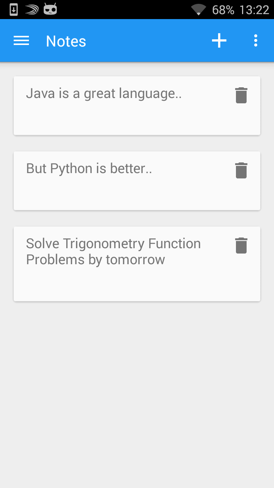

##Notes: An Android Notes App

This is a Notes app created by me that I will try to make more feature rich and functional.

I'm using various open source libraries along with the support libraries to make this app work. The design is pure Material Design and uses lots of Cards.

###Features

1. Rich Text Editor to edit Notes
2. Card Based Interface
3. Tag Support (ongoing)
4. Mention Support (ongoing)
5. Cloud Save (To-Do)

###Installation

An APK will be available once the app is feature complete

###About

Created by Pradipta. MIT Licensed. Copyright 2015.
